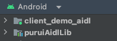
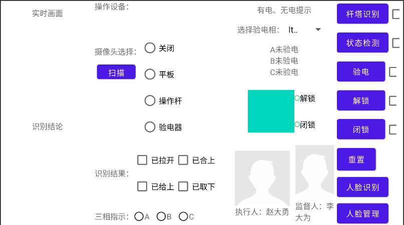
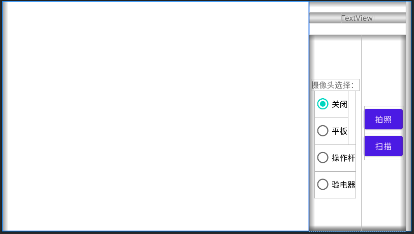
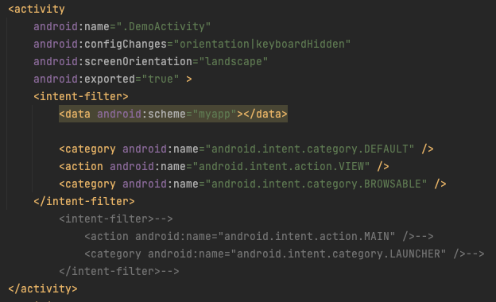
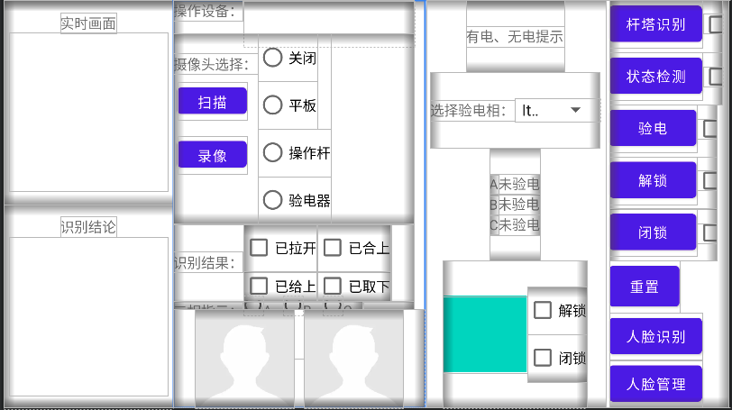
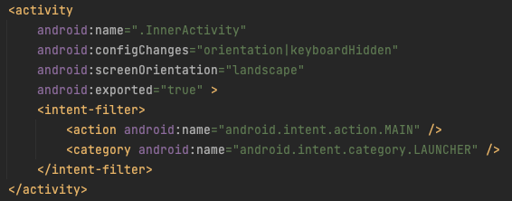
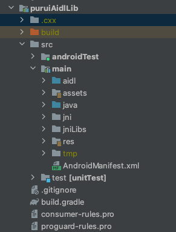
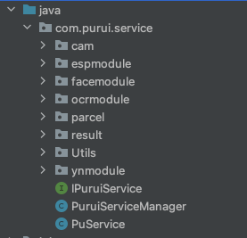
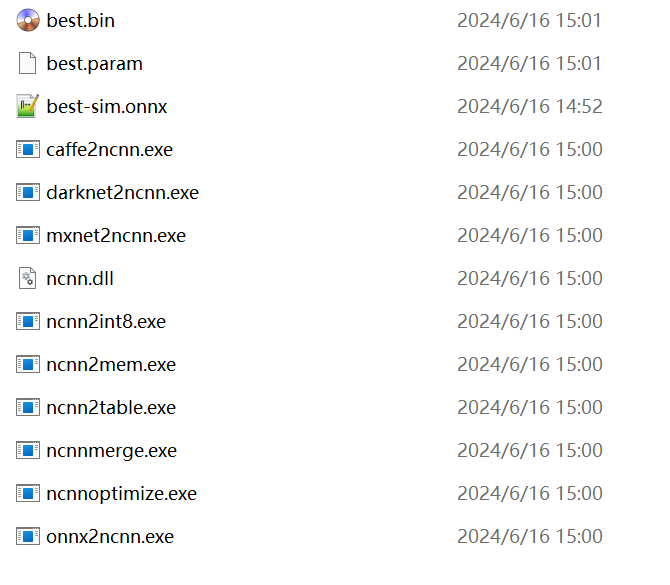

# 电网项目代码说明文档

**项目名: [dianwang_project](https://github.com/jrchen2022a/dianwang_project)**

## 分支

1. forYoute：交付给优特公司的aar包源码（后面优特的APP好久没再要求更新了，主要以forPurui分支为主）
2. forPurui：交付给i国网应用的“本地程序”app源码
3. ~~forPaper：论文APP端界面，请忽略~~

## 代码结构

**modules：**



1. client_demo_aidl：为应用程序的测试界面，不含实际功能
2. puruiAidlLib：功能的实现库，打包给优特的aar只需用这个

### 界面（client_demo_aidl）：

**forYoute：**

DemoActivity.java

功能顾名思义，跟遥控器一个道理，用于测试给优特提供的功能是否正常。代码中有相关注释，不难理解。

**forPurui:**

两个界面：

 1. 提供给普瑞的“本地AI程序”：DemoActivity.java 

    

​	左边显示相机帧，右上角为i国网传过来解析的参数（传过来的intent使用base64编码过了），代码主要用于解析来自i国网的信号，有注释。

两个入口：

- 来自i国网的intent
- 调试时可设置MAIN，在AndroidManifest文件里面配置

​			

2. 调试功能的程序：InnerActivity.java

   

​	遥控器+1，所有模块顾名思义，代码注释也较多。

​	这里顺便解释下为何forYoute和forPurui两个分支调用puruiAidlLib库（即IPuruiService接口）的方式不同，最开始作者不熟悉Java，使用的方式比较简朴（forYoute中把所有控件都注册一通），后来理解Java后写的方式容易扩展也更人性化（forPurui中普遍使用接口与回调接口），但是优特他们贯彻“代码能跑”就不动的原则，不允许作者更改，故保留两种方式书写接口，个人认为使用接口的方式高级一些，且能在合作开发时降低代码耦合度~~（不容易被甩锅）~~，**强烈建议后来者在与其他人合作开发时最开始就协商好使用接口与回调接口的方式完成功能交付，避免后期麻烦**。

​	想调试基本功能的话，得去AndroidManifest里面更改成MAIN，这个Activity就是用来测试我们开发的功能是否正常的，也**多用于测试更新的模型是否有效**。

​			


## puruiAidlLib库模块介绍

这里是核心代码，所有功能实现都在这，以下以forPurui分支为例



- .cxx 开头的为检测模型相关ndk代码自动生成的，可忽略（模型部署一般会用到ndk开发，即使用c++代码写模型的调用流程，再提供java接口给上层java代码使用，称为ndk开发，有兴趣可以百度）

- 其他的为Android项目常见目录，

  - java代码在src/main/java中

    

    - 包名是com.purui.service
    - IPuruiService为提供给外部调用的接口
    - PuruiServiceManager为IPuruiService的具体实现，包括使用AIDL的方式启动我们定义的服务进程（PuService），完成各个功能模块的前置与后续操作等（多数为处理输入与输出数据的格式）
    - PuService为服务本身，用于具体调用各个功能
    - cam包为本地摄像头相关代码
    - espmodule为esp32cam调用的代码
    - facemodule为人脸相关代码
    - ocrmodule为文字识别相关代码
    - ynmodule为目标检测模型调用（即yolov5）的相关代码
    - parcel为自定义的由PuService回传至PuruiServiceManager的对象（因为AiDL只允许基本类型）
    - result为定义的返回给前端界面的结果格式
    - Utils为处理工具（主要为项目代码书写过程中将一些静态方法归纳到这里）

  - aidl为AIDL接口，初期优特的奇妙想法要求我们用AIDL接口保证进程独立（熟悉Android的自然知道不用AIDL也可以做到，后续因为改动麻烦就保留了）

  - assets与res为资源保存文档

  - jni为yolov5检测模型与人脸模型的ndk调用源码（基于ncnn的开发）

  - jniLIbs为用到的jar包依赖与c++动态库（arm64-v8a为设备cpu算子类型，使用ndk开发时需要考虑），动态库包含jni处调用的依赖、百度ocr模型调用（文字识别）所需依赖（具体可参考paddleocr项目，路径为deploy/android-demo）、从exp32cam摄像头录制视频时使用的ffmpeg等库

代码的详细内容在各个代码文件中有相关注释，没有的话请参考方法名。总体来讲，如果涉及到接口改动（一般是输入输出格式问题），只需在IPuruiServce与PuruiServiceManager中进行相应更改，涉及到具体功能改动则根据调用链条一步步索引到相关模块进行更改（链条是PuruiServiceManager -> IPuAidlInterface -> PuService -> IxxxHandle（如果有的话）-> 具体功能模块的实现代码）

阅读功能的相关实现与PuService定义需要具有一定的Android开发基础，不懂的原生类百度一下

## 模型更换流程

### 检测模型

基本流程如下：[参考博客](https://blog.csdn.net/LHYlhy0825/article/details/123060624)

1. 将新的拍摄样本使用labelimg打标签成yolov5格式后混进原数据集中，路径为服务器1: /home/jrchen/datasets/dianwang/10c_reduce/yolo/outs/yolo

2. 使用yolov5训练新数据集

   ```
   conda activate yolov5_arrow
   cd ~/projects/arrow_shooting/yolov5
   python train.py --epoch 300 --batch 16 --data ./data/dianwang.yaml --cfg ./models/yolov5s.yaml --weight runs/train/exp15/weights/best.pt --workers 8
   ```

   conda环境名称为yolov5_arrow（可与射箭项目共用训练代码）

   使用的模型是yolov5s，数据集定义为data/dianwang.yaml，上一版本的模型为exp15中的best.pt

3. 将新模型转换成ncnn模型

   1. PT转ONNX
      在yolov5-master根目录下有export.py文件，可以直接采用转换命令：

      ``` 
      python export.py --data ./data/dianwang.yaml --weights ./runs/train/exp18/weights/best.pt --img 640 --batch 1 --train
      ```

      会在./runs/train/exp18/weights目录下生成best.onnx和best.torchscript

   2. 简化ONNX

      ```
      cd runs/train/exp18/weights
      python -m onnxsim best.onnx best-sim.onnx
      ```

      生成best-sim.onnx

   3. ONNX转param、bin

      下载编译好的：[Releases · Tencent/ncnn · GitHub](https://github.com/Tencent/ncnn/releases)，根据自己的平台和配置选择合适的编译好的文件。此处可选[ncnn-20240102-windows-vs2019-shared.zip](https://github.com/Tencent/ncnn/releases/download/20240410/ncnn-20240410-windows-vs2019-shared.zip)，下载到自己的windows电脑上，然后解压，进入路径./x64/bin，使用onnx2ncnn.exe来实现转换，需要先将第二步的best-sim.onnx复制到./x64/bin中并转到此位置的cmd，输入：

      ```
      onnx2ncnn.exe best-sim.onnx best.param best.bin
      ```

      就会生成以下best.bin和best.param文件

      

   4. 将best.bin替换Android目录中的原best.bin

      Android目录为：./dianwang_project/puruiAidlLib/src/main/assets/best.bin

### 文字识别模型

使用的是[PaddleOCR](https://github.com/PaddlePaddle/PaddleOCR)，目前只是使用官方提供的v2模型（包含文字检测、方向识别、文字识别三个模型）

由于前期尝试过自己训练模型，但识别效果远不如官方v2模型，故没成功替换。

替换思路为：使用PaddleOCR的训练流程训练采集数据集，并将训练的模型转化为其支持的.nb文件，最后替换assets/models文件夹下的三个模型，注意命名一致（ocr模型不好训练，建议与文字识别相关的需求先尝试原模型能否应用，不行就推了... 尽量推了吧，文字识别方面我也只是个调包侠）


